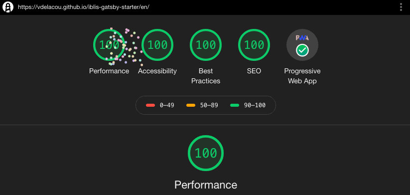

# Iblis Gatsby Starter

_**Starter for Gatsby with Material-UI, Typescript, Internationalisation and Audit Lighthouse 100%!**_



## Demos

- [EN Demo](https://vdelacou.github.io/iblis-gatsby-starter/)
- [FR Demo](https://vdelacou.github.io/iblis-gatsby-starter/fr/)
- [404 Demo](https://vdelacou.github.io/iblis-gatsby-starter/whatever)

## Why

As I need to start new static website quite often, I create a starter with all my basic configuration

After some search, I didn't find any starter or theme which has the following requirements :

- Written in pure Typescript
- Use last version of [Material-UI](https://material-ui.com/)
- Easy to change the look with Material-UI Theme
- Have Translation keys in json files and different static page for each language with redirect according to browser language
- Generate SEO different for each page and each language
- Resize the pictures on build to reduce the bundle size
- Generate sitemap and robots.txt
- Be compliant as WPA, generate the manifest.json and works offline

## Dev

`npm install -g gatsby-cli`

`npm init private`

Follow the inscrution here at `Setup prettier`

https://gist.github.com/vdelacou/58484f1c11af70aaa457f4e5c289e893#file-readme-md

Add the `tsconfig.json`

`curl -o tsconfig.json https://raw.githubusercontent.com/vdelacou/iblis-gatsby-starter/master/tsconfig.json`

`npm install @material-ui/core gatsby gatsby-image gatsby-plugin-intl iblis-react-undraw react react-dom react-helmet`

`npm install --save-dev @types/node @types/react @types/react-dom @types/react-helmet gatsby-plugin-manifest gatsby-plugin-nprogress gatsby-plugin-offline gatsby-plugin-react-helmet gatsby-plugin-robots-txt gatsby-plugin-sharp gatsby-plugin-sitemap gatsby-source-filesystem gatsby-theme-material-ui gatsby-transformer-sharp typescript`

Add the `gatsby-config.js`

`curl -o gatsby-config.js https://raw.githubusercontent.com/vdelacou/iblis-gatsby-starter/master/gatsby-config.js`

Add the `.gitignore`

`curl -o .gitignore https://raw.githubusercontent.com/vdelacou/iblis-gatsby-starter/master/.gatsby_gitignore`

Copy the code to your src folder

`mkdir src`

`curl https://codeload.github.com/vdelacou/iblis-gatsby-starter/tar.gz/master | tar -xz --strip=1 iblis-gatsby-starter-master/src`

Add the script to `package.json`

```
  "scripts": {
    "build": "gatsby build --prefix-paths",
    "develop": "gatsby develop",
    "start": "npm run develop",
    "serve": "gatsby serve",
    "clean": "gatsby clean",
    "lint": "eslint ./src --ext .js,.jsx,.ts,.tsx"
  },
```

```sh
npm install
npm run develop
```

## Build

This will create all the robots.txt , sitemap, ect ...

```sh
npm install
export PATH_PREFIX=''
export SITE_URL='https://www.example.com/'
npm run build
```

## How to build for the github demo

```sh
npm install
export PATH_PREFIX='iblis-gatsby-starter'
export SITE_URL='https://vdelacou.github.io/iblis-gatsby-starter/'
npm run clean
npm run build
mv public/* docs/
```

## Contribute

1.  [Fork](https://help.github.com/articles/fork-a-repo/) this repository to your own GitHub account and then [clone](https://help.github.com/articles/cloning-a-repository/) it to your local device
2.  Make the necessary changes and ensure that the tests are passing
3.  Send a pull request

## Todo

- There is always room to improve :)

## Known issues

- None for the moment :)

## Thanks

- [Gatsby](https://www.gatsbyjs.org) for make so easy to deploy static site and finally get rid of wordpress
- [Material-UI](https://material-ui.com/) for the fantastic work

## License

Please, refer to LICENSE file
